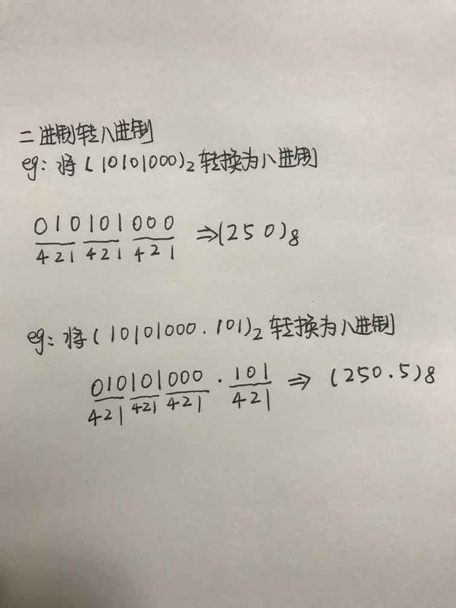
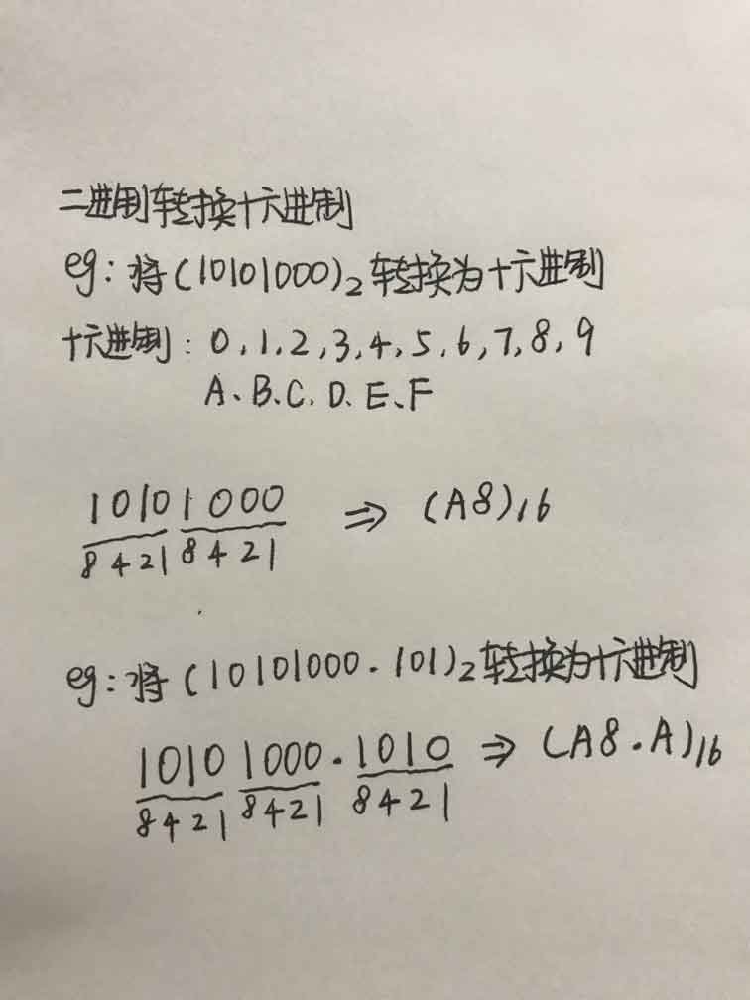
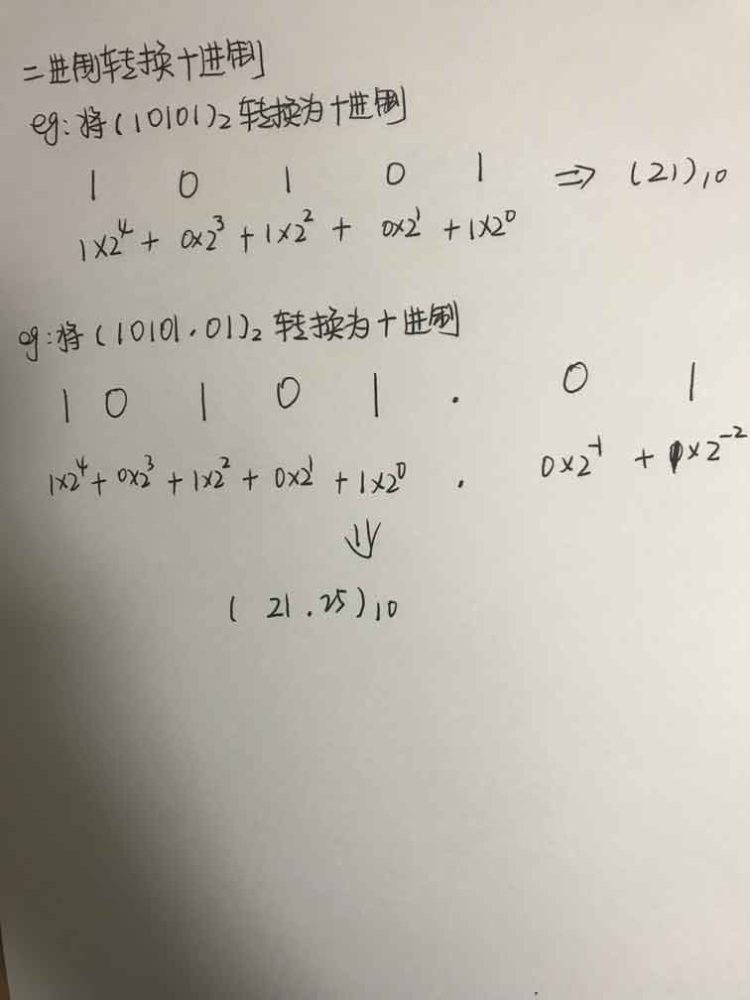

# 计算机系统基础知识
+ 计算机五大部件：运算器、控制器、存储器、输入设备、输出设备
+ 运算器和控制器等部件集成在一起称为CPU（central processing unit）

# CPU
+ CPU功能:程序控制，操作控制，时间控制，数据处理  

+ CPU组成：运算器，控制器，寄存器组和内部总线等部件组成

## 运算器
+ 运算器组成:
    + 算术逻辑单元（ALU）:负责处理数据，实现对数据的算术运算和逻辑运算
    + 累加寄存器(AC):通用寄存器，其功能是当运算器的算术逻辑单元执行算术或逻辑运算时为ALU提供一个工作去
    + 数据缓冲寄存器（DR）:在对内存进行读/写操作时，用DR暂时存放由存储器读/写的一条指令或一个数据字。作为CPU和内存，外部设备之间数据传送的中转站。
    + 条件状态寄存器（PSW）：保存由算术指令和逻辑指令运行或测试的结果建立的各种条件码内容，分为状态标志和控制标志
+ 运算器功能：数据加工处理部件，用于完成计算机各种算术运算和逻辑运算

## 控制器
+ 控制器组成：
    + 指令控制逻辑：完成取指令，分析指令，执行指令
        + 指令寄存器（IR）:当CPU执行一条指令时，先从内存储器取到缓冲寄存器中，再送如IR暂存，指令译码根据IR的内容产生各种微操作指令，控制其他的组成部件工作完成所需要的功能
        + 程序计数器（PC）：PC具有寄存信息和计数两种功能，称为指令计数器。程序的执行分为两种情况，一是顺序执行，二是转移执行
        + 地址寄存器（AR）：AR保存当前CPU访问的内存单元地址
        + 指令译码器（ID）：指令分为操作码和地址码。
    + 时序控制逻辑：为每条指令按时间顺序执行提供应有的控制信号
    + 总线控制逻辑：为多个功能部件服务的信息通路的控制电路
    + 中断控制逻辑：用于控制各种中断请求，并根据优先级的高低对中断请求进行排队，逐个交给CPU处理
+ 控制器功能：用于控制整个CPU的工作，决定了计算机运行过程的自动化，不仅要保证程序的正确执行，而且要能够处理异常

## 寄存器组
+ 通用寄存器：用途广泛并可由程序员规定其用途
+ 专用寄存器：运算器和控制器中的寄存器是专用寄存器

# 数据表示
常用的进制包括：二进制，八进制，十进制，十六进制

## 二进制转八进制 十进制 十六进制
+ 二进制转八进制  

 
+ 二进制转十六进制  
 

+ 二进制转十进制  

 
