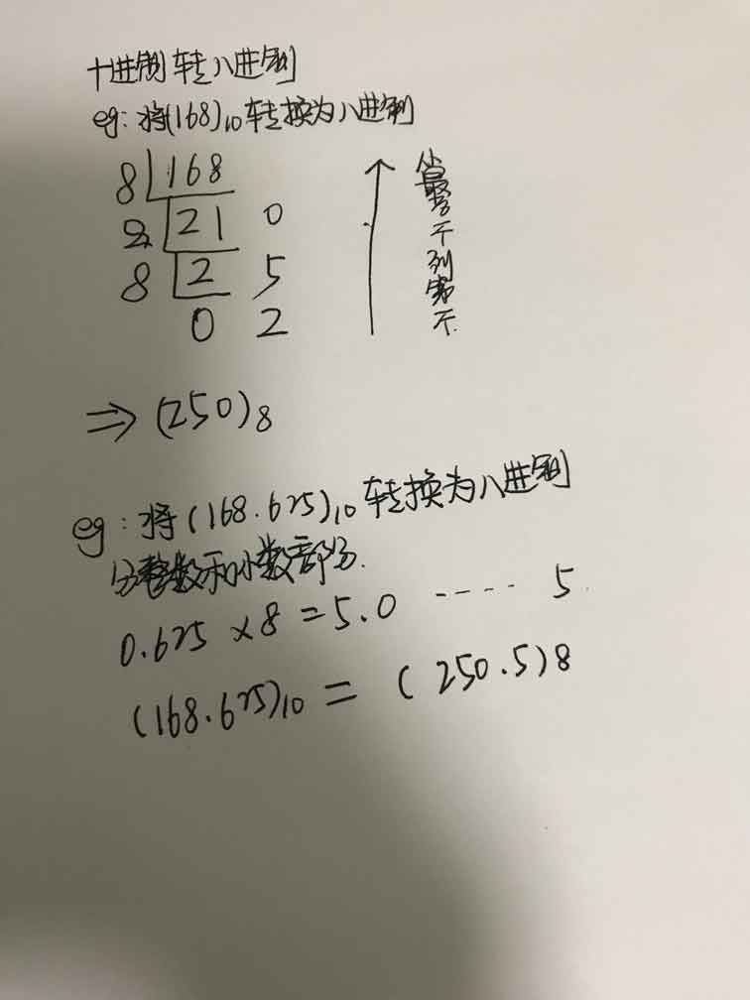
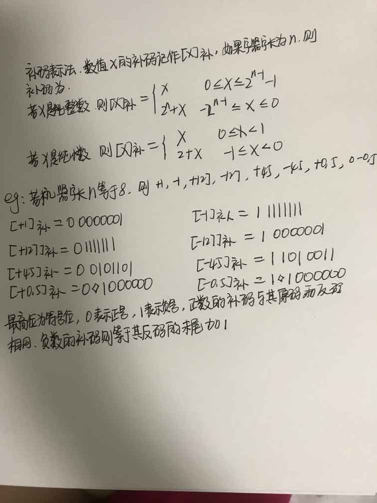

# 计算机系统基础知识
+ 计算机五大部件：运算器、控制器、存储器、输入设备、输出设备
+ 运算器和控制器等部件集成在一起称为CPU（central processing unit）

# CPU
+ CPU功能:程序控制，操作控制，时间控制，数据处理  

+ CPU组成：运算器，控制器，寄存器组和内部总线等部件组成

## 运算器
+ 运算器组成:
    + 算术逻辑单元（ALU）:负责处理数据，实现对数据的算术运算和逻辑运算
    + 累加寄存器(AC):通用寄存器，其功能是当运算器的算术逻辑单元执行算术或逻辑运算时为ALU提供一个工作去
    + 数据缓冲寄存器（DR）:在对内存进行读/写操作时，用DR暂时存放由存储器读/写的一条指令或一个数据字。作为CPU和内存，外部设备之间数据传送的中转站。
    + 条件状态寄存器（PSW）：保存由算术指令和逻辑指令运行或测试的结果建立的各种条件码内容，分为状态标志和控制标志
+ 运算器功能：数据加工处理部件，用于完成计算机各种算术运算和逻辑运算

## 控制器
+ 控制器组成：
    + 指令控制逻辑：完成取指令，分析指令，执行指令
        + 指令寄存器（IR）:当CPU执行一条指令时，先从内存储器取到缓冲寄存器中，再送如IR暂存，指令译码根据IR的内容产生各种微操作指令，控制其他的组成部件工作完成所需要的功能
        + 程序计数器（PC）：PC具有寄存信息和计数两种功能，称为指令计数器。程序的执行分为两种情况，一是顺序执行，二是转移执行
        + 地址寄存器（AR）：AR保存当前CPU访问的内存单元地址
        + 指令译码器（ID）：指令分为操作码和地址码。
    + 时序控制逻辑：为每条指令按时间顺序执行提供应有的控制信号
    + 总线控制逻辑：为多个功能部件服务的信息通路的控制电路
    + 中断控制逻辑：用于控制各种中断请求，并根据优先级的高低对中断请求进行排队，逐个交给CPU处理
+ 控制器功能：用于控制整个CPU的工作，决定了计算机运行过程的自动化，不仅要保证程序的正确执行，而且要能够处理异常

## 寄存器组
+ 通用寄存器：用途广泛并可由程序员规定其用途
+ 专用寄存器：运算器和控制器中的寄存器是专用寄存器

# 数据表示
常用的进制包括：二进制，八进制，十进制，十六进制

## 二进制转八进制 十进制 十六进制
+ 二进制转八进制  

 
+ 二进制转十六进制  
 

+ 二进制转十进制  

## 八进制转二进制 十进制 十六进制
+ 八进制转二进制  

+ 八进制转十六进制:将八进制转换为二进制，二进制转换为十六进制
+ 八进制转十进制  

## 十进制转二进制 八进制 十六进制
+ 十进制转二进制  

+ 十进制转八进制  

+ 十进制转十六进制

## 十六进制转二进制 八进制 十进制
+ 十六进制转二进制  

+ 十六进制转八进制：先将十六进制转二进制，二进制转八进制
+ 十六进制转十进制  

# 带符号的的机器数可采用原码、反码、补码、移码
各种数值在计算机中表示的形式为机器数，其特点是采用二进制计数制，数的符号用0和1表示，小数点则隐含，表示不占位。  
机器数有无符号和有符号数之分。无符号表示正数，在机器数中没有符号位。带符号数，机器数的最高位表示正，负的符号位。
## 原码

## 反码

## 补码 

## 移码
  

 # 定点数
 小数点的位置固定不变的数。小数点的位置通常有两张约定：定点正数和定点小数
机器字长为n
<table>
    <thead>
        <tr>
            <td>码制</td>
            <td>定点整数</td>
            <td>定点小数</td>
        </tr>
    </thead>
    <tbody>
        <tr>
            <td>原码</td>
            <td>-(2n-1 - 1) ~ + (2n-1 - 1)</td>
            <td>-(1-2-(n-1)) ~ +(1 - 2-(n-1))</td>
        </tr>
        <tr>
            <td>反码</td>
            <td>-(2n-1 - 1) ~ + (2n-1 - 1)</td>
            <td>-(1-2-(n-1)) ~ +(1 - 2-(n-1))</td> 
        </tr>
        <tr>
            <td>补码</td>
            <td>-2n-1 ~ + (2n-1 - 1)</td>
            <td>-1 ~ +(1 - 2-(n-1))</td>     
        </tr>
        <tr>
            <td>移码</td>
            <td>-2n-1 ~ + (2n-1 - 1)</td>
            <td>-1 ~ +(1 - 2-(n-1))</td>
        </tr>
    </tbody>
</table>
 
# 浮点数
当机器字长为`n`时，定点数的补码和移码可表示2n-1个数，而其原码和反码只能表示2n-1 -1个数，因此定点数所能表示的数值范围比较小，在运算中容易结果溢出。从而引入浮点数，浮点数时候小数点位置固定不变的数，可能表示范围更大的数。  
在十进制中，`83.125`可以写成`0.083125*10^3`或者`0.0083125*10^4`
在二进制中`1011.10101`可以写成`0.101110101*2^4`或者`0.0101110101*2^5`  
所以一个二进制数`N`可以表示为N=2E*F,其中`E`为阶码，`F`为尾数，用阶码和尾数表示的数称为浮点数  
浮点数的格式为:
<table>
    <tr>
        <td>阶符</td>
        <td>阶码</td>
        <td>数码</td>
        <td>尾数</td>
    </tr>
</table>
一个数的浮点表示不是唯一，当小数点的位置改变是，阶码也随着改变  

+ 若尾数M>=0,尾数限定在区域[0.5,1]。
+ 若尾数M<0,尾数限定在区域[-1,-0.5]

若浮点数的阶码用R位的移码表示，尾数用M位的补码表示则
+ 最大正数:+(1-2-M+1)*2(2R-1-1)
+ 最小负数:-1*2(2R-1-1)

## 工业标准IEEE754标准  
(-1)S2E(b0b1b2b3...bp-1)  
其中(-1)S为该浮点数的数符，当S为0时表示正数，S为1时表示负数，E为指数(阶码)用移码表示，尾数：(b0b1b2b3...bp-1),其长度为p用原码表示
<table>
    <thead>
        <tr>
            <td>参数</td>
            <td>单精度浮点数</td>
            <td>双精度浮点数</td>
            <td>扩充精度浮点数</td>
        </tr>
    </thead>
    <tbody>
        <tr>
            <td>浮点数字长</td>
            <td>32</td>
            <td>64</td>
            <td>80</td>
        </tr>
        <tr>
            <td>尾数长度p</td>
            <td>23</td>
            <td>52</td>
            <td>64</td>
        </tr>
        <tr>
            <td>符号位S</td>
            <td>1</td>
            <td>1</td>
            <td>1</td>
        </tr>
        <tr>
            <td>指数长度E</td>
            <td>8</td>
            <td>11</td>
            <td>15</td>
        </tr>
        <tr>
            <td>最大指数</td>
            <td>+127</td>
            <td>+1023</td>
            <td>+16383</td>
        </tr>
        <tr>
            <td>最小指数</td>
            <td>-126</td>
            <td>-1022</td>
            <td>-16382</td>
        </tr>
        <tr>
            <td>指数偏移量</td>
            <td>+127</td>
            <td>+1023</td>
            <td>+16383</td>
        </tr>        
        <tr>
            <td>可表示的实数范围</td>
            <td>10-38 ~ 10+38</td>
            <td>10-308 ~ 10+308</td>
            <td>10-4932 ~  10+4932</td>
        </tr>                                      
    </tbody>
</table>

## 利用IEEE754标准表示将数176.0625表示为单精度浮点数
+ 将十进制转换成二进制：(176.0625)10 = (10110000.00010)2
+ 格式化处理:10110000.00010 = 1.011000000010*2^7
+ 将b0去掉并扩展为单精度浮点数所规定的的23位尾数：011000000010000000000000
+ 求阶码，指数为7,单精度浮点数的偏移量为127那么，E=7+127=134，指数的移码为10000110
+ 结果为:0  10000110  011000000010000000000000

# 校验码
## 奇偶校验码
通过在编码中增加一位校验位是编码中1的个数为奇数（奇校验）或者为偶数（偶校验），对于奇校验，可以检测代码中奇数位出错的编码，但不能发现偶数位出错的情况，即当合法编码的奇数位发生错误时，即编码中的0变成1或1变成0，则该编码中1的个数的奇偶性就发生了变化，从为可以发现错误  
常用的奇偶校验有:水平奇偶校验码，垂直奇偶校验码和水平垂直校验码  

**如果是奇校验加上校验位后,编码中1的个数为奇数个。如果是偶校验加上校验位后,编码中1的个数为偶数个。**

### 水平奇偶校验码
水平奇偶校验码对每一个数据的编码添加校验位,使信息位与校验位处于同一行.

| 原编码 |  奇校验 |  偶校验  |
| ----  |:------:| -------:|
| 0010  | 0010 0 | 0010 1  
| 1100  | 1100 1 | 1100 0  
| 1010  | 1010 1 | 1010 0

### 垂直奇偶校验码
垂直奇偶校验码把数据分成若干组,一组数据排成一行,再加一行校验码. 针对每一行列采用奇校验 或 偶校验

例: 有32位数据10100101 00110110 11001100 10101011   

| 垂直奇校验 |  垂直偶校验 |        |  
| -------  |:---------:| ------:|  
| 10100101 |  10100101  |  数据  |  
| 00110110 |  00110110  |       |   
| 11001100 |  11001100  |       |  
| 10101011 |  10101011  |       |  
| 00001011 |  11110100  |  校验  |

### 水平垂直奇偶校验码
水平垂直奇偶校验码就是同时用水平校验和垂直校验
例:  

| 奇校验奇水平 |    偶校验   | 偶水平 |  
| ---------  |:----------:| ------:|  
| 10100101 1 | 10100101 0 |  数据  |  
| 00110110 1 | 00110110 0 |       |  
| 11001100 1 | 11001100 0 |       |  
| 10101011 0 | 10101011 1 |       |   
| 00001011 0 | 11110100 1 |  校验  |

## 海明码
海明码是利用奇偶性来检错和纠错校验方法。海明码的构成方法是在数据位之间的确定位置上插入k个校验码，通过扩大码距来实现检错和纠错。  

**设数据位是n位，校验位是k位，则n和k必须满足**
2k -1 >= n+k  

海明码的编码规则如下:
+ 设k个校验位为Pk,Pk-1,...,P1
+ n个数据位Dn-1,Dn-2,...,D0
+ 对应的海明码为Hn+K,Hn+K-1,...,H1
    + Pi在海明码的第2i-1位置，即Hj = Pi,且**j = 2i-1**,数据位则依次从低到高位占据海明码中剩下的位置  
    + 海明码中的任何一位都是由若干校验位来校验的，被**校验的海明位下标等于所有参与校验位的下标之和，而校验位由自身校验**
    
对于8位的数据位，进行海明校验需要4个校验位(23-1=7,24-1=15>8+4)   
令数据位为D7,D6,D5,D4,D3,D2,D1,D0  
校验位为P4,P3,P2,P1
则形成的海明码位为:H12,H11,H10,...,H3,H2,H1

## 海明校验
+ 确定D与P在海明码中的位置

P1--> 21-1  = 1 --> H1  
P2--> 22-1  = 2 --> H2  
P3--> 23-1  = 4 --> H4  
P4--> 24-1  = 8 --> H8  

| H12 | H11 | H10 | H9  |  H8 |  H7 |  H6 |  H5 |  H4 |  H3 |  H2 |  H1 |
|----------------|:--------------:|:--------------:|:--------------:|:--------------:|:--------------:|:--------------:|:--------------:|:--------------:|:--------------:|:--------------:|:--------------:|
| D7  | D6  | D5  | D4  |  P4 |  D3 |  D2 |  D1 |  P3 |  D0 |  P2 |  P1 |  

+ 确定校验关系  

|              海明码              |      海明码下标    |    校验位组   |       说明      |  
|---------------------------------|:----------------:|:--------- --:|:----------------:|  
|  H1(p1)   | 1                |p1 |  
|  H1(p1)   | 1                |p1 |  
|  H1(p1)   | 1                |p1 |  
|  H1(p1)   | 1                |p1 |  
|  H1(p1)   | 1                |p1 |  
|  H1(p1)   | 1                |p1 |  
|  H1(p1)   | 1                |p1 |  
|  H1(p1)   | 1                |p1 |  
|  H1(p1)   | 1                |p1 |  
|  H1(p1)   | 1                |p1 |  
|  H1(p1)   | 1                |p1 |  
|  H1(p1)   | 1                |p1 |                 |